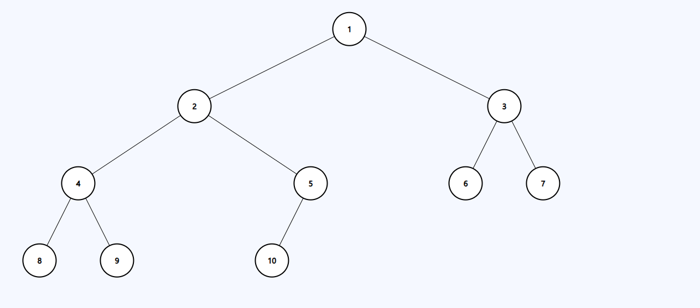
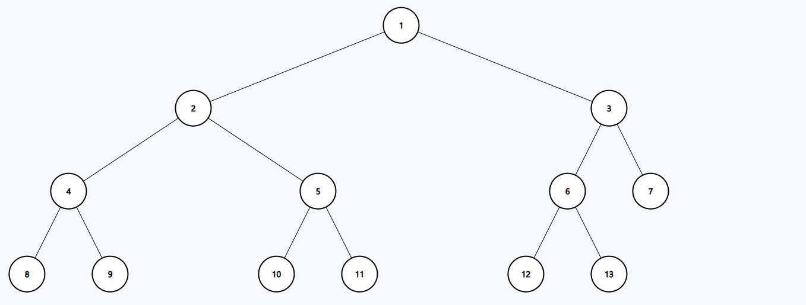
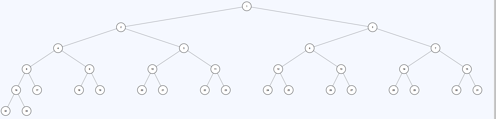
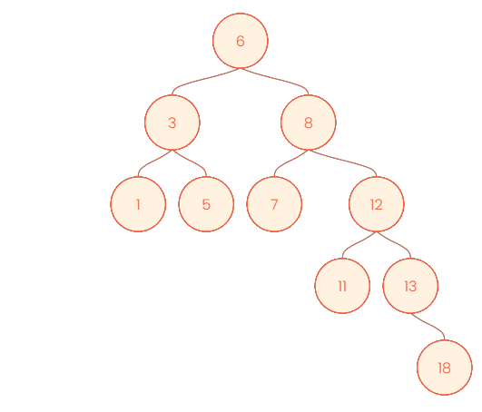

# Message Handler
Core of this project is to calculate the shortest time period in which a message
will travel all over the binary graph. This algorithm is adaptable to every kind of
binary tree (change Insert function in case). The only condition is that the graph has
to be binary (i.e. parent, left child, right child).

## Source Code
I prepared two different types of binary trees (balanced and unbalanced) to demonstrate
that it is easily adaptable to various binary trees.
*   **Balanced trees:**
    * Insertion is inspired by MinHeap algorithm. This algorithm inserts new nodes
      in order from the very left to very right edge (priority queue: left > child).
    * This way how to insert nodes is very likely the most efficient for the message
      to travel over the tree
    * 
    * 
    * 

*   **Unbalanced trees:**
    * In this case the nodes are inserted based on Binary Search Tree algorithm.
    * Final tree is not balanced which leads to longer time period for the message
      to be handled all over the tree.
    * 