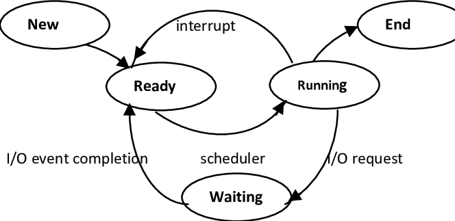

# OSY
## Prednasky
### Přednáška 1
- Operační systém je mezivrstva mezi uživatelem a hardwarem.
- Je to jediná cesta, jak se dostat k hardware
- Pohledy
  - Shora (user-os-hw)
    - Unifikované funkce - jednotná sada funkcí, které jsou dostupné všem programům nehledě na zařízení
  - Zdola (hw-os-user)

- Dávkové zpracování (2 a 3 generace PC)
- 3 generace
  - počátek paralelismu (byl přidán timesharing)
- 4 generace
  - PC jak je dnes známe

- Procesy
  - Jakmile někde v počítači běží nějaký kód, tak musí být zabalen v procesu
  - Seznam procesů je v systému veřejný
  - *Jednotka, která se stará o část kódu, který je vykonán*
  - OS se stará o vlánka jako o procesy
  - Jsou uspořádány do stromu
  - Adress Space
    - Každý proces má svůj vlastní prostor
    - Nemohou do sebe zasahovat
    - *Obálka procesu, kterou nesmí kód překročit* -> seg. fault
  - Soubory
    - Vše je v OS chápáno jakou soubor
    - Adresáře jsou soubory, které obsahují další soubory
    - Každý soubor, adresář v procesu (při běheu) definovány souborovým deskriptorem
      - Do systému se jinak než deskriptorem nelze dostat
      - Nejsou přenositelné mezi procesy, každý proces si generuje dle svého deskriptoru
    - Souborový systém
      - Struktura je stom 
    - Dělíme na dvě skupiny
      - Znakové
      - Blokové
      d - directory
        - x - procházetelný adresář
        - x - spustitelný soubor
      c - znakové zařízení, proudy dat, nelze se vracet zpátky
      b - blokové zařízení, má svou formu a lze se pohybovat
      s - socket
      p - roura
  - Shell
    - Interaktivní program, který přijímá příkazy a předává je OS
  - MAN (manuálové stránky)
    - Systém, kterým se budeme dostávat k manuálovým stránkám
    - Ty jsou rozděleny do několika sekcí
      - 1 - Základní příkazy/programy
        - Základní příkazy, které jsou součástí OS
      - 2 - Systémové volání (napr open, read, write, close)
        - Volání systému, která nezávisí na programovacím jazyku
        - Žádná knihovna to nedokáže obejít
      - 3 - Knihovny
        - Knihovny, které jsou připojeny k programovacímu jazyku
        - Vícestavová návratová hodnota, jejíž return value nelze ošetřit jedním ifem

### Přednáška 2 & 3
- Monolitické systémy (zjistit)
- Mikrokernely (zjistit)
#### Procesy a vlákna
  - Procesy
    - Prgram x process
      - Program je hrstka insturkcí
      - Proces je spuštěný program
    - Timesharing
      - Kdyz proces ceka na jakekoliv data, tak muze preskocit a zpracovavat procesy v mezicase nekde jinde
      - Prepinaci cas se pohybuje v rozmezi milisekund
    - Procesum muzeme posilat signaly
      - SIGKILL - ukonci proces
      - SIGSTOP - pozastavi proces
      - SIGCONT - pokracuje proces
      - syntax: ``kill -SIGSTOP 37531``
    - Stavy procesu
      - Run
        - Drobne okamziky, kdyz procesor neco zpracovava
        - Vetsinu casu je ve stavu id (idle)
      - Block
        - Proces ceka na jakekoliv data
        - Chceme neco cist, cekame na vstup, cekame na vystup
        - Tyto procesy jsou celkem pomale
        - Proces muze byt zablokovany na jak dlouho chceme
      - Ready
        - Proces je pripraveny k behu
        - Ceka ve fronte
      - Exit
        - Ukonceni procesu
        - Pro ukonceni procesu je nutno projit stavem WAIT, jinak muzou vznikat zombie procesy
        - Tyto zombie procesy vznikaji hlavne pri ukoncovani forku
      - Zmena stavu dle obrazku
        - planovac: ready -> run 
      - 
    - Vytvareni procesu
      - fork()
        - rozdvoji proces na dva identicke duplikaty
        - lisi se od sebe process id
        - 
          ```cpp
          #include <stdio.h>
          #include <stdlib.h>
          #include <unistd.h>
          #include <sys/wait.h>

          int main() {
            printf('Zacina proces PID %d', getpid() );
            if (fork() == 0) {
              printf('Potomek PID %d', getpid();) 
            } else {
              printf('Rodic PID %d', getpid();) 
            }
            wait( NULL )
          }
          ```
        - Vytvoreni roury
          - Roura je virtualni soubor
          - Fronta waitu, ktera ma vstupni a vystupni bod
          - Vznika misto proces
          - Roura se musi vytvorit pred forkem
          - 0 -> Read
          - 1 -> Write
        ```cpp
          #include <stdio.h>
          #include <stdlib.h>
          #include <unistd.h>
          #include <sys/wait.h>

          int main() {
            int mojeroura[ 2 ];
            pipe( mojeroura );
            if (fork() == 0) {
              while (1){
                char buf[ 333 ]:•
                int ret = read( mojeroura[ 0 ], buf, sizeof( buf) );
                if (ret <= 0) break; • write( 1, buf, ret );
              }
              exit(0);
            } else {
              for (int i = 0; i < 10; i++){
                char buff[ 1024];
                sprintf('Cislo %d', rand() % 10000);
                write (mojeroura[ 1 ], buf, strlen(buf));
                usleep(500 * 10000)
              }
            }
            wait( NULL )
          }
          ```

### Prednaska 4
### Vlakna
- Vlakna jsou procesy, ktere maji spolecny adresní prostor
- Vlakna sdileji sve data
- Pri prepinani neni nutne mazat cashe
- Vzdy je jedno hlavni vlakno
- Na jednom vlakne muze bezet vice procesu
- Vlakna puvodne nemely existovat, jazyk C na to nebyl pripraven
- Nektere funcke musely byt preprogramovane, aby fungovaly ve vlaknech
  - problemy s koncepci knihoven a OS
  - asctime_r, ctime_r, ... (vetsina konci _r)
  - errno - puvodne vracelo pouze cislo, nyni je to pointer na string
- IPC (Inter Process Communication)
  - zjistit
- Soubeh (Race Contition)
  - zjistit
- Kriticka sekce (Critical Section)
  - zjistit
- Vzajemne vylouceni (Mutial Exclusion)
  - Vztahuje se k jedne kriticke sekci
  - Neni mozne, aby byl udelen pristup do kriticke sekce ze dvou stran soucasne
  - Spravne reseni:
    1. Procesy se musi dostat do kriticke sekce jeden po jednom
    2. Nehledi se na rychlost ci pocet CPU
    3. Pokud je proces mimo kritickou sekci, tak by nemel blokovat kritickou sekci (jinak by mohlo dojit k zablokovani)
    4. Nikdy se nesmi cekat na vstup do kriticke sekce do nekonecna (System garantuje, ze se proces dostane do konecneho stavu v konecnem case)


### Prednaska 5
- Mutual Exclusion with Busy Waiting
  - Zakaz preruseni 
    - Pouziva se pouze u malych systemu
    - Nelze pouzit u vetsich systemu
  - Zamykaci promenna
    - TSL (Test and Set Lock)
      - Neprerusitelna strojova instrukce, ktera provede lock a jeho test zaroven
      - Timto je system chraneny proti preruseni behem procesu zamceni
  - Semafory
    - Semafor resi bezpecne zamykani a take zapinani a vypinani
    - Binarni semafor
      - Ma omezeny rozsah prace, ktera garantuje chod kriticke sekce
      - Ma pouze dve hodnoty (0/1)
      - 0 - usina
