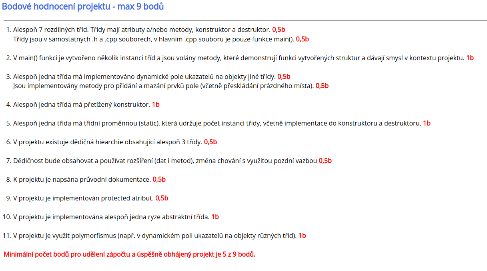

# Pizzeria: Semestral Project (OOP)

1. Over 7 classes, each one of them is in cpp/h file
2. Pizzeria class is created and used in main()
3. Implemented in Pizzeria, Menu, Order, Employees
4. Overloaded constructor in pizzeria
5. Static is used in Order, Pizza, Drink
6. AbstractEmployee, Employee, Cook, Delivery
7. EployeeInfo() in all employees
8. This one :)
9. Protected is used in Pizza, Menu, Drink, Employee
10. AbstractEmployee is abstract class
11. POLYMORPHISM